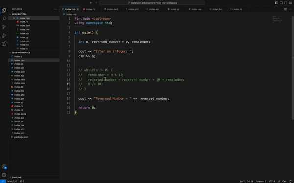

# Comment Block Extension

## Overview

The "Block Commenter" extension for Visual Studio Code (VS Code) provides functionality to quickly uncomment block comments in various programming languages. It detects and handles different styles of block comments, including single-line (`//`), multi-line (`/* */`), JSX block comments (`{/* */}`), Python block comments (`""" """`), and many more. The extension allows developers to efficiently uncomment entire comment blocks with a single command.

## Features

Seamless Uncommenting: This extension allows users to uncomment any block of code with a single command, regardless of the cursor's position within the comment. The extension accurately detects the beginning and end of comment blocks based on the cursor position and the content of the document. It ensures that the entire comment block is uncommented, even if it spans multiple lines or contains nested comment structures.

Context-Aware Mechanism: 'Block Commenter' intelligently detects the type and boundaries of comments, whether they are single-line comments, multi-line blocks, or JSX comments, ensuring accurate uncommenting.

Precision in Code Cleanup: 'Block Commenter' meticulously removes comment delimiters and leading asterisks, aligning the uncommented code perfectly with the rest of the codebase and eliminating superfluous whitespace.

Supported Comment Styles
The extension supports the following comment styles:

- Single-line comments (`//`)
- Multi-line comments (`/\* _/`)
- JSX block comments (`{/* */}`)
- Python single-line comments (`#`)
- Python block comments (`""" """`)
- HTML block comments (`<!-- -->`)
- Ruby block comments (`=begin and =end`)

## How to Use

To use the "Comment Block" extension, follow these steps:

- Open a file containing commented code in VS Code.
- Place the cursor inside the comment block you want to uncomment.
- Execute the "Block Commenter" command by press `Ctrl+Shift+/` for Windows or Linux and: `Cmd+Shift+/` for Mac OS. This immediately uncomments the comment block.

## Configuration

The "Block Commenter" extension does not require any configuration. However, developers can customize the behavior of the extension by modifying settings in the settings.json file. Available configuration options include:

## Troubleshooting

If you encounter any issues with the "Block Commenter" extension, consider the following troubleshooting steps:

Ensure that the extension is installed and enabled in VS Code.
Verify that the cursor is positioned correctly inside the comment block before executing the "Block Commenter" command.
Check for conflicts with other extensions that may modify comment behavior or keybindings.
If the issue persists, you can report it on the extension's GitHub repository for further assistance.

## Contributing to the Extension

Contributions to the "Block Commenter" extension are welcome! If you have ideas for new features, improvements, or bug fixes, feel free to submit a pull request on the extension's GitHub repository. Be sure to follow the contribution guidelines and code of conduct when contributing to the project. Contribute to the repository here: [GitHub comment-block
](https://github.com/davidadeola/comment-block)

## Support and Contact Information

For questions, feedback, or support related to the "Block Commenter" extension, you can contact the maintainer via email at adeoladavidoluwole@gmail.com or through the extension's GitHub repository.

## Licensing

The "Block Commenter" extension is licensed under the MIT License. By using or contributing to the extension, you agree to the terms and conditions of this license.
